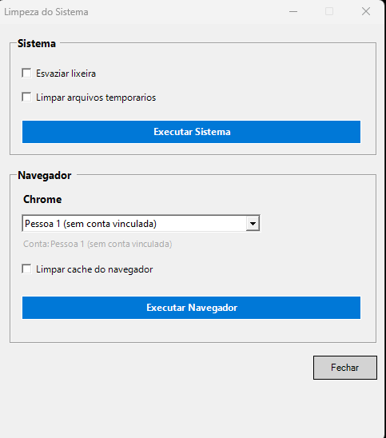
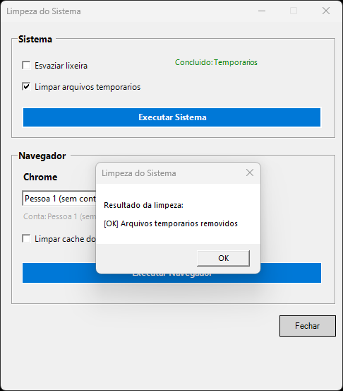

# 🧹 Limpeza do Sistema

Ferramenta de manutenção para Windows com interface gráfica, feita em **PowerShell + WinForms**. Automatiza tarefas repetitivas de limpeza — lixeira, arquivos temporários e cache do navegador — sem exigir conhecimento técnico do usuário final.

🇺🇸 [Read in English](README.md)


## 📋 Sobre o projeto

Manter um Windows limpo geralmente significa repetir manualmente as mesmas ações: esvaziar a lixeira, apagar temporários, limpar cache do navegador. Este script reúne essas tarefas em um painel único, com feedback visual do que está sendo feito e do resultado de cada operação.

## ✨ Funcionalidades

- **Limpeza do sistema**
  - Esvaziar a Lixeira
  - Remover arquivos temporários (`%TEMP%` e `C:\Windows\Temp`)
- **Limpeza de navegador (Chrome)**
  - Detecção automática de todos os perfis instalados (inclusive vinculados a contas Google)
  - Limpeza seletiva de cache (Cache, Code Cache, GPUCache, Service Worker Cache, etc.)
  - **Histórico e senhas salvas são preservados** — apenas dados de cache são removidos
- **Interface gráfica simples**, feita com WinForms, sem dependências externas
- Feedback de status em tempo real para cada operação
- Tratamento de erros isolado por tarefa (uma falha não interrompe as demais)

## 🖥️ Screenshots

| Main window | Task result |
|:---:|:---:|
|  |  |

## ⚙️ Requisitos

- Windows 10 ou superior
- PowerShell 5.1 ou superior (já vem instalado no Windows)
- Google Chrome instalado (necessário apenas para a limpeza de cache do navegador)

## 🚀 Como usar

1. Baixe o arquivo `system-cleanup.ps1` deste repositório.
2. Clique com o botão direito no arquivo e selecione **"Executar com PowerShell"**.
   - Caso a execução de scripts esteja bloqueada no seu sistema, abra o PowerShell como administrador e rode:
     ```powershell
     Set-ExecutionPolicy -Scope Process -ExecutionPolicy Bypass
     ```
     em seguida, execute o script novamente.
3. Na janela que abrir:
   - Marque as tarefas desejadas na seção **Sistema** e clique em **Executar Sistema**.
   - Selecione o perfil do Chrome desejado na seção **Navegador**, marque **Limpar cache do navegador** e clique em **Executar Navegador**.

## ⚠️ Avisos importantes

- O script **fecha o Chrome automaticamente** antes de limpar o cache (necessário para liberar os arquivos em uso). Salve seu trabalho antes de executar.
- A limpeza de arquivos temporários e da lixeira é **irreversível**. Use com atenção.
- Este projeto foi desenvolvido e testado em ambiente de staging. Recomenda-se revisar o código antes de usar em produção ou em máquinas críticas.

## 🗂️ Estrutura do projeto

```
├── system-cleanup.ps1     # Main script
├── system-cleanupBR.ps1   # Main script
├── LICENSE
├── .gitignore
├── README.md             # This file (English)
└── README.pt-BR.md       # Portuguese version
```

## 🛠️ Tecnologias

- **PowerShell** — lógica de limpeza e manipulação de arquivos
- **Windows Forms (WinForms)** — interface gráfica
- **JSON parsing** — leitura do arquivo `Local State` do Chrome para detecção de perfis

## 🤝 Contribuindo

Sugestões, correções e melhorias são bem-vindas! Sinta-se à vontade para abrir uma *issue* ou enviar um *pull request*.

## 📄 Licença

Este projeto está sob a licença MIT. Veja o arquivo [LICENSE](LICENSE) para mais detalhes.

---

Desenvolvido por **Bruno Lira**.
